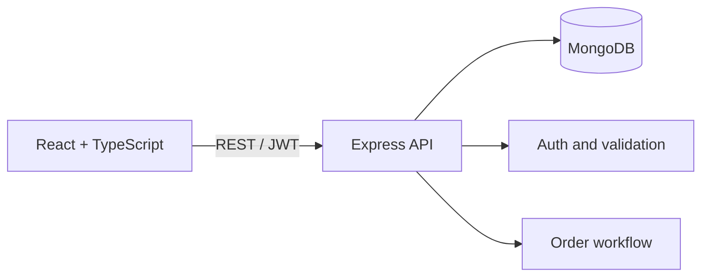

# FoodHub — Full-Stack Food Ordering Platform

FoodHub is a portfolio-ready MERN application that lets customers discover restaurants, order menu items, and track fulfillment while administrators manage operational order status. It demonstrates end-to-end product ownership across user experience, API design, authentication, database modeling, workflow automation, testing, and containerized deployment.

## Highlights

- Customer registration and login with hashed passwords and JWT authentication
- Restaurant search, menu browsing, cart, delivery checkout, and order history
- Admin operations console with role-based authorization and order-state management
- Server-side pricing that prevents clients from submitting manipulated totals
- Zod validation, Helmet security headers, rate limiting, CORS, and centralized errors
- MongoDB models for users, restaurants, embedded menus, and orders
- Responsive React interface built with TypeScript and accessible form controls
- Docker Compose environment for the web application, API, and MongoDB
- Seeded restaurants and administrator demo account
- Automated API smoke test and production builds

## Architecture



## Technology

React 19, TypeScript, Vite, React Router, Express 5, Node.js, MongoDB, Mongoose, JWT, Zod, Vitest, Supertest, Docker, NGINX.

## Local setup

### Prerequisites

- Node.js 20+
- MongoDB 7+ locally, or Docker Desktop

### Run with Node.js

```bash
cp .env.example .env
npm install
npm run seed
npm run dev
```

Open `http://localhost:5173`. The API runs at `http://localhost:5000/api`.

### Run with Docker

```bash
docker compose up --build
docker compose exec api node dist/seed.js
```

### Demo administrator

- Email: `admin@foodhub.dev`
- Password: `Admin123!`

Use demo credentials only for local development. Change or remove them before public deployment.

## API overview

| Method | Endpoint | Access | Purpose |
|---|---|---|---|
| POST | `/api/auth/register` | Public | Register customer |
| POST | `/api/auth/login` | Public | Authenticate user |
| GET | `/api/restaurants` | Public | Search restaurants |
| GET | `/api/restaurants/:id` | Public | View restaurant and menu |
| POST | `/api/orders` | Customer | Place validated order |
| GET | `/api/orders/mine` | Customer | View order history |
| GET | `/api/admin/orders` | Admin | View operational queue |
| PATCH | `/api/admin/orders/:id/status` | Admin | Advance order workflow |
| POST | `/api/admin/restaurants` | Admin | Create restaurant |

## Order lifecycle

`placed → confirmed → preparing → out_for_delivery → delivered`

Administrators can also mark an order as `cancelled`.

## Quality checks

```bash
npm test
npm run build
```

## Suggested portfolio demo

1. Register a customer and browse the seeded restaurants.
2. Add items, enter a delivery address, and place an order.
3. Sign in with the demo admin account and advance the order status.
4. Return to the customer account to show the updated order history.

## Roadmap

- Stripe test-mode payments
- Image uploads with S3-compatible object storage
- Live order updates using WebSockets
- Restaurant-owner role and analytics dashboard
- OpenAPI documentation and end-to-end browser tests

## Author

Sai Varun Gowtham — [LinkedIn](https://www.linkedin.com/in/saivarungowtham/)
